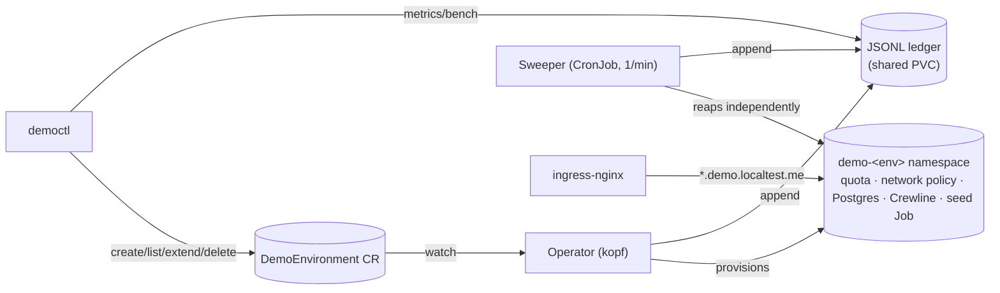
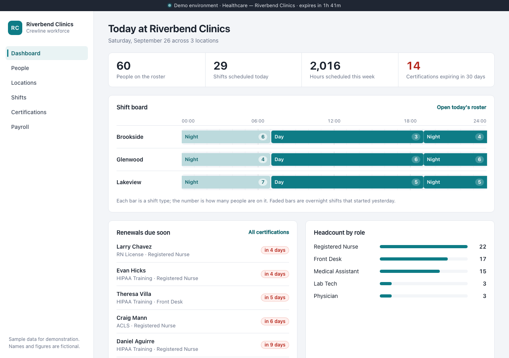
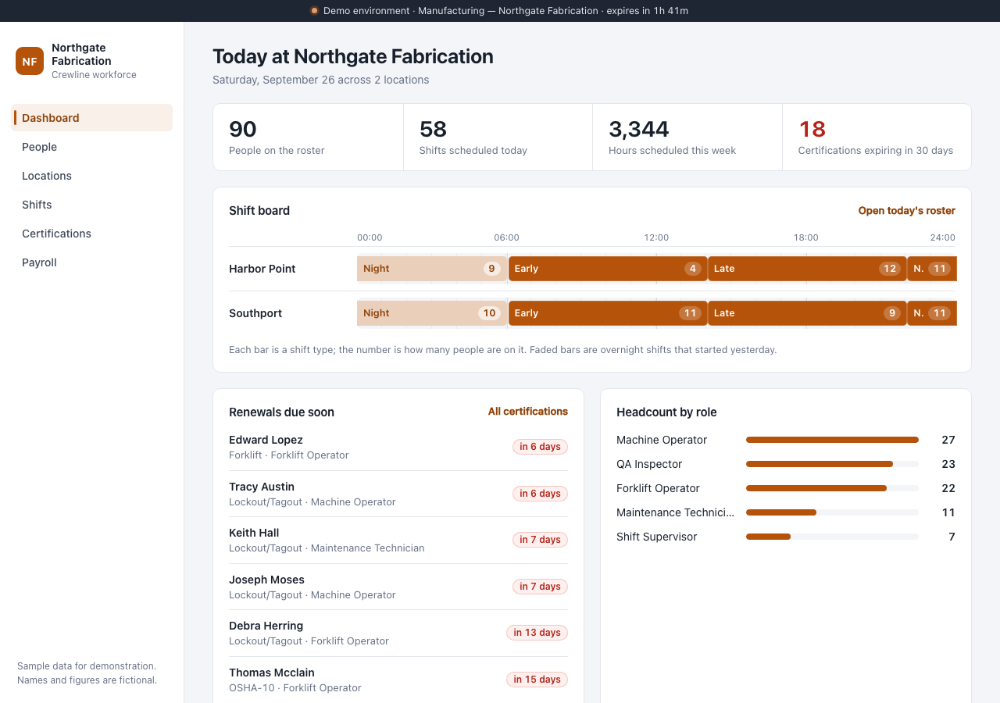

# Demo Environment Orchestrator

A Kubernetes operator, written in Python with [kopf](https://kopf.readthedocs.io/),
that provisions isolated, persona-seeded demo environments on demand and reliably
tears them down when their TTL expires. Ask for a `healthcare` or `manufacturing`
demo and get a real namespace — its own quota, network policy, Postgres and a
branded sample SaaS app, seeded with deterministic fixture data — reachable at a URL
within about 30 seconds, gone again on schedule even if the operator itself is down
when the clock runs out. Every lifecycle event is recorded in an append-only ledger
that the headline metrics (provisioning time, cleanup reliability, cost) are computed
from directly, not typed in by hand.

## Architecture



Full diagram with every component, plus a walkthrough of the two-layer expiry path:
[`docs/architecture.md`](docs/architecture.md).

## Crewline, two personas side by side

The same app, reseeded and rebranded per persona — different company name, color,
roster size and roles, generated from `personas/<name>/persona.yaml`:

| Healthcare — Riverbend Clinics | Manufacturing — Northgate Fabrication |
|---|---|
|  |  |

## Quickstart

**Prerequisites:** Docker (daemon running — e.g. Docker Desktop started),
[kind](https://kind.sigs.k8s.io/), `kubectl`, Helm 3, and [`uv`](https://docs.astral.sh/uv/).

```bash
git clone <this repo> demo-orchestrator && cd demo-orchestrator
make up                                            # kind cluster + ingress-nginx + build + load + deploy
uv run democtl create --persona healthcare --ttl 30m
```

`democtl create` prints the environment's name, URL and expiry once it's `Ready`
(`democtl get <name>` shows the phase timings). Visit the printed
`http://<name>.demo.localtest.me` URL in a browser.

Tear the whole local cluster down with `make down`.

If `make up` fails partway (or you're retrying after a prior run), run `make down`
first — `make up`'s `cluster` target isn't idempotent and errors with `node(s)
already exist for a cluster with the name "demo-orchestrator"` if one is already
present.

## CLI tour

```bash
democtl personas                                   # list available personas
democtl create --persona healthcare --ttl 2h        # → prints name, URL, expiry; waits for Ready
democtl list                                        # table: name, persona, phase, age, expires-in, URL
democtl get healthcare-7f3k                         # full status incl. phase timings
democtl extend healthcare-7f3k --by 30m             # capped at the persona's max_ttl
democtl delete healthcare-7f3k                      # immediate teardown
democtl metrics --since 7d --from-cluster           # provisioning p50/p95, cleanup reliability, cost
democtl bench --persona healthcare --n 10 --ttl 2m  # N create→ready→expire cycles, then metrics
```

A `DemoEnvironment` is also a first-class Kubernetes object — `democtl` is a
convenience, not the only interface:

```yaml
apiVersion: orchestrator.local/v1alpha1
kind: DemoEnvironment
metadata:
  name: healthcare-7f3k
spec:
  persona: healthcare
  ttl: 2h
  requestedBy: evan        # optional, free text, recorded in the ledger
```

```bash
kubectl apply -f my-demo.yaml
kubectl get de                                      # short name for demoenvironments
```

## Measured results

From a real `democtl bench --persona healthcare --n 10 --ttl 2m --from-cluster` run
on a local kind cluster (see [`docs/results.md`](docs/results.md) for the full
report, the raw log, environment, and cost methodology):

| Provisioning (n=10) | Cleanup | Chaos / resilience |
|---|---|---|
| p50 **28.0s**, p95 **35.8s** | 10/10 on time, lag p50 **13.2s**, p95 **14.9s** | Sweeper-backstop test: expired env reaped with the operator scaled to **0** |

Run `democtl bench` yourself to reproduce these against your own cluster — every
number in `docs/results.md` comes from the ledger, not from a spreadsheet.

## Design decisions

Five ADRs plus recorded limits (RBAC scope, the RWO ledger's single-node
requirement, at-least-once ledger events, and more): [`docs/decisions.md`](docs/decisions.md).

## What I'd do next

- **Warm pool** — pre-provision and seed N idle namespaces per persona so `create`
  claims one instead of building from scratch, and measure cold vs. warm
  provisioning time instead of just asserting the trade-off (see `PROJECT.md` S1).
- **GKE** — move off kind onto a real Autopilot cluster with Artifact Registry
  images and the ledger on GCS (object-per-event, so the RWO single-node limit in
  `docs/decisions.md` ADR 5 goes away), and record real cost against `pricing.yaml`
  instead of the on-demand model (`PROJECT.md` S3).
- **Prometheus metrics** — `demo_provision_seconds`, `demo_active_envs`,
  `demo_cleanup_lag_seconds` emitted by the operator directly, plus a Grafana
  dashboard, so `democtl metrics` isn't the only view into the system
  (`PROJECT.md` S4).

## Development

```bash
make test    # unit tests
make lint    # ruff + mypy
make e2e     # integration tests against a running kind cluster (needs `make up`)
make bench   # democtl bench --persona healthcare --n 10 --ttl 2m --from-cluster
```

See [`AGENTS.md`](AGENTS.md) for repository conventions and
[`docs/demo-script.md`](docs/demo-script.md) for a 2-minute walkthrough shot list.
