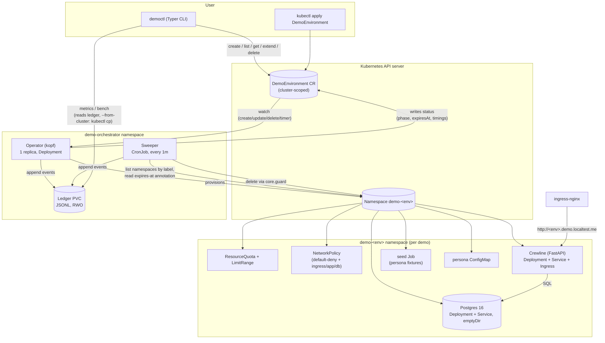

# Architecture

## Diagram

## Components

1. **`orchestrator.core`** — pure logic, no Kubernetes I/O: duration parsing, persona
   loading, naming, expiry maths, the deletion guard, the ledger, metrics, sweep
   planning, pricing. This is where nearly all unit tests live, and the only package
   held to `mypy --strict`.
2. **`orchestrator.operator`** — kopf handlers reconciling `DemoEnvironment` objects:
   `on.create` provisions (namespace → quota/network policy → Postgres → Crewline →
   seed Job, each phase timed into `status.timings`); a field handler on `spec.ttl`
   recomputes `status.expiresAt`; a `@kopf.timer` expires environments whose TTL has
   elapsed; `on.delete` (behind a finalizer) deletes the namespace through the guard
   and waits for it to be gone before releasing the finalizer.
3. **`orchestrator.sweeper`** — a one-shot process run by a CronJob every minute. It
   never imports kopf: it lists namespaces by the `managed-by` label directly, reads
   each one's `expires-at` annotation, calls `core.sweep.plan_sweep` and executes the
   resulting actions (or skips, with a warning, on a missing/corrupt annotation —
   reaping only once age exceeds 8h + grace). It is the reliability backstop: it
   works even while the operator is completely down.
4. **`orchestrator.cli`** (`democtl`) — a Typer app that talks to the Kubernetes API
   directly with the user's kubeconfig (create/patch CRs, list/get status) and reads
   the ledger for `metrics`/`bench`, either from a local file or via `kubectl cp`
   from the operator's pod (`--from-cluster`, needed because the in-cluster operator
   writes to the PVC, not the invoking machine).
5. **`demoapp` (Crewline)** — the seeded sample app shown inside every demo: a
   small FastAPI app (Dashboard, People, Locations, Shifts, Certifications, Payroll)
   rendered with persona branding, backed by Postgres. `demoapp.seed` builds
   deterministic fixtures from the persona's config with a fixed Faker seed, so a
   given persona always looks the same. `/healthz` reports process liveness;
   `/readyz` requires the database to be reachable *and* the seed marker row to
   exist, so the Ingress won't route traffic before seeding finishes.
6. **Helm chart (`charts/demo-orchestrator`)** — installs the CRD (from `crds/`,
   applied server-side by `make deploy` before `helm upgrade` since Helm never
   upgrades a chart's `crds/` directory — see `docs/decisions.md` (e)), the operator
   Deployment, the sweeper CronJob, least-privilege RBAC with separate
   ServiceAccounts for operator and sweeper, the ledger PVC, and a ConfigMap of all
   personas built from `personas/`.

## Two-layer expiry, end to end

1. A `DemoEnvironment` is created (CLI or raw YAML). `status.createdAt` is set and
   `status.expiresAt = createdAt + spec.ttl`.
2. The operator provisions the namespace and everything in it, timing each phase,
   and mirrors `expiresAt` onto the namespace as an annotation
   (`orchestrator.local/expires-at`) — the sweeper's only source of truth.
3. **Primary path:** the operator's own timer handler notices `now >= expiresAt`,
   transitions the CR to `Expiring`, deletes the namespace through
   `core.guard.is_deletable_namespace`, waits for it to be gone, then writes a
   `deleted` ledger event and releases the finalizer.
4. **Backstop path:** independently, every minute, the sweeper lists all
   `managed-by=demo-orchestrator` namespaces, checks each one's annotation itself,
   and reaps anything past `expiresAt + grace` — regardless of whether the operator
   is running, crash-looping, or mid-restart. If it beats the operator to it, it
   also strips the CR's finalizer so the CR isn't left waiting on an operator that
   may not come back soon (Ruling R14; `docs/decisions.md` (d)).
5. Both paths append to the same JSONL ledger; `core.metrics` de-duplicates by
   taking the first terminal event per environment (`docs/decisions.md` (f)).

See `docs/decisions.md` for the reasoning behind each of these choices and their
known limits, and `docs/results.md` for measured provisioning/cleanup numbers.
